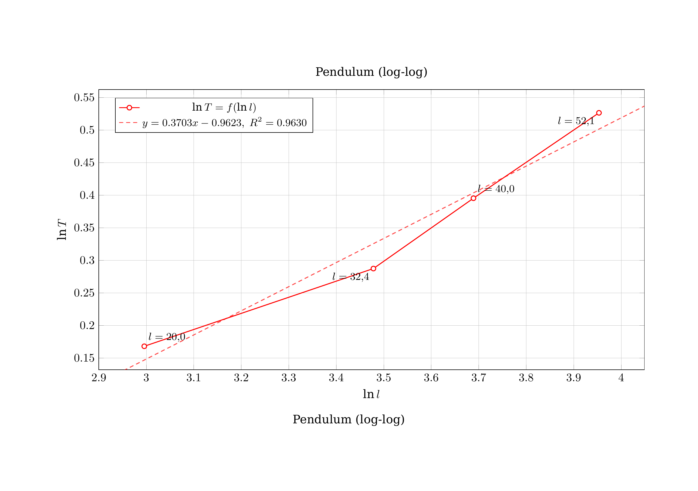

# Automated Lab Report Plotter

[](LICENSE)

A CLI tool that generates publication-ready PDF graphs from CSV data via LaTeX/pgfplots. Designed for lab reports and scientific work.

## Features

- **CSV Input**: Reads any CSV file with named columns — no code required.
- **Multiple Series**: Plot several Y columns on one graph with automatic color assignment.
- **Data Transforms**: Built-in transforms for X and Y axes: `id`, `ln`, `log10`, `sqrt`, `sq`, `diff`.
- **Linear Regression**: Optional least-squares fit line with equation and R² value rendered directly on the plot (`--fit linear`).
- **Smart Legend Placement**: Automatically places the legend in the least-crowded quadrant.
- **Point Labels**: Configurable per-point labels with `{xn}`, `{x}` and `{y}` placeholders.
- **Smooth Curves**: Optional curve smoothing via pgfplots tension splines (`--smooth`).
- **Localization**: babel language and fontspec font are fully configurable.
- **PDF Output**: Compiles directly to PDF via XeLaTeX — no intermediate steps.

## Technologies Used

- **Node.js**: Runtime
- **pgfplots / XeLaTeX**: Graph rendering and PDF compilation
- **csv** (`csv/sync`): CSV parsing
- **yargs**: CLI argument handling

## Prerequisites

- **Node.js** ≥ 18
- **XeLaTeX** (part of TeX Live or MiKTeX)

### System Dependencies

The tool requires `xelatex` and several LaTeX packages (`pgfplots`, `amsmath`, `caption`, `fontspec`).

#### Ubuntu / Debian
```bash
sudo apt update
sudo apt install texlive-xetex texlive-fonts-recommended texlive-plain-generic texlive-latex-extra texlive-science
```

#### Windows
1. Install [MiKTeX](https://miktex.org/download) or [TeX Live](https://www.tug.org/texlive/).
2. MiKTeX will automatically prompt to install missing packages on the first run. Ensure you have internet access.

## Getting Started

1. Clone the repository:
   ```bash
   git clone https://github.com/ChernegaSergiy/lab-graph.git
   ```

2. Install dependencies:
   ```bash
   npm install
   ```

3. Run against your CSV:
   ```bash
   node src/index.js -i examples/data.csv -x l -y T --xunit cm --yunit s --title "Pendulum Period" -o graph.pdf
   ```

## CSV Format

The first row must be a header with column names. Example (`examples/data.csv`):

```
l,T
20.0,1.183
32.4,1.333
40.0,1.485
52.1,1.693
```

## Usage

```
Usage: lab-graph -i <csv> -x <col> -y <col> [options]

Input / Output:
  -i, --input       Path to CSV file                         [string] [required]
  -o, --output      Output PDF path              [string] [default: "graph.pdf"]
      --latex-only  Only generate .tex file, do not compile
                                                      [boolean] [default: false]

Columns & Transforms:
  -x           X column name                                 [string] [required]
  -y           Y column name(s)                               [array] [required]
      --xfunc  Transform applied to X values
   [string] [choices: "id", "ln", "log10", "sqrt", "sq", "diff"] [default: "id"]
      --yfunc  Transform applied to Y values
   [string] [choices: "id", "ln", "log10", "sqrt", "sq", "diff"] [default: "id"]

Appearance:
      --smooth       Draw smooth curves               [boolean] [default: false]
      --fit          Add a regression line: none | linear
                          [string] [choices: "none", "linear"] [default: "none"]
      --title        Chart title                     [string] [default: "Graph"]
      --xlabel       X-axis label                        [string] [default: "X"]
      --ylabel       Y-axis label                        [string] [default: "Y"]
      --xunit        Unit for X axis (e.g. cm)                          [string]
      --yunit        Unit for Y axis (e.g. s)                           [string]
      --legend       Legend labels for each Y series                     [array]
      --legend-pos   Legend position (auto = smart placement)
  [string] [choices: "auto", "north east", "north west", "south east", "south we
                                      st", "outer north east"] [default: "auto"]
      --caption      Figure caption (defaults to title)                 [string]
      --point-label  Point label template. Use {xn}, {x} and {y} as placeholders
                     .                        [string] [default: "${xn} = {x}$"]
      --labels       Enable point labels (use --no-labels to disable)
                                                       [boolean] [default: true]
      --lang         babel language              [string] [default: "ukrainian"]
      --font         Main font (fontspec name)[string] [default: "DejaVu Serif"]

Options:
      --version  Show version number                                   [boolean]
      --help     Show help                                             [boolean]
```

## Professional Point Labels

To get professional-looking labels with units where the variable is italic and the unit is upright:
```bash
--point-label '${xn} = {x}$ \text{cm}'
```

To disable point labels entirely (useful for graphs with many points):
```bash
--no-labels
```

## Examples

**Basic plot:**
```bash
node src/index.js -i examples/data.csv -x l -y T \
  --xunit cm --yunit s --title "Pendulum"
```



**Log-log transform with regression:**
```bash
node src/index.js -i examples/data.csv -x l -y T \
  --xfunc ln --yfunc ln --fit linear \
  --xunit "" --yunit "" --title "Pendulum (log-log)"
```

**Multiple series:**
```bash
node src/index.js -i examples/data.csv -x t -y v1 v2 v3 \
  --xunit s --yunit m/s --legend "Run 1" "Run 2" "Run 3" --title "Velocity Comparison"
```

## Contributing

Contributions are welcome and appreciated! Here's how you can contribute:

1. Fork the project
2. Create your feature branch (`git checkout -b feature/AmazingFeature`)
3. Commit your changes (`git commit -m 'Add some AmazingFeature'`)
4. Push to the branch (`git push origin feature/AmazingFeature`)
5. Open a Pull Request

Please make sure to adhere to the existing coding style.

## License

This project is licensed under the CSSM Unlimited License v2.0 (CSSM-ULv2). See the [LICENSE](LICENSE) file for details.
